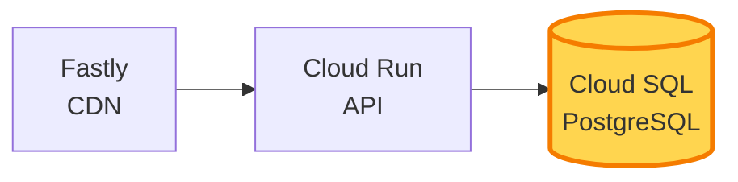

<style>
.slidev-layout {
  text-align: left;
}
</style>

# 「わたしがやっていることは、<br>果たしてSREなのだろうか？」

## 〜負荷試験から始める、積み上げ式オブザーバビリティ〜

<br><br>

<TitleFooter 
  :eventName="$frontmatter.eventName" 
  :eventDate="$frontmatter.eventDate" 
  :speakerName="$frontmatter.speakerName" 
/>

<!--
- 挨拶・選んでくれたことへの感謝
  - 皆さん、こんにちは。本日はたくさんあるセッションの中から、こちらを選んでいただき、ありがとうございます。
- タイトル紹介
  - 「わたしがやっていることは、果たして SRE なのだろうか？」〜負荷試験から始める、積み上げ式オブザーバビリティ〜というタイトルでお話させていただきます。
- 30 分セッション
  - 30 分間、よろしくお願いします。
-->

---
layout: two-cols
duration: 90
---

# 自己紹介

## Arihito Ota （sakai-nako）


<div class="flex gap-2 mt-4 justify-center w-[95%]">
  
  
  
</div>


::right::

<style>
li {
  margin-top: 0.1rem;
  margin-bottom: 0.1rem;
}
li p {
  margin: 0.4rem 0;
}
</style>

- コンビニバイト10年の後、IT業界に飛び込む （2017～）
- フェンリル: インフラエンジニア<br/>in [NILTO](https://www.nilto.com/ja) Team (2024/7～)
- 「理想の彼女がいなければ、自分で作ればいいじゃない」<br/>と思い立ち、女装を始める （2019～）
- コミュニティ活動
  - Jagu'e'r 関西分科会
  - AI駆動開発勉強会 神戸支部
- [個人サイト](https://hack-pleasantness.com/) （延々とリニューアル中……）


<!--
- まずは自己紹介からはじめさせてください
- 名前・この姿の時はsakai-nakoというハンドルネーム
- コンビニ 10 年 → 2017 年 IT 業界へ
  - コンビニのアルバイトを 10 年やったあと、2017 年に IT 業界に飛び込んできました。
- フェンリル NILTO チームのインフラエンジニア
  - 現在はフェンリル株式会社で、NILTO チームのインフラエンジニアをしています。
- 女装、2019年から
- コミュニティ活動
- まだ SRE と名乗りきれない立場で話す
  - SRE と名乗りたい気持ちはあるんですが、まだそう言い切れずにいる、そんな立場で今日はお話しします。
-->

---
duration: 50
---

# おしながき

1. 自己紹介
2. NILTOについて
3. バラバラの負荷試験をまとめる
4. 積み上げ式オブザーバビリティ
5. 「答え合わせ」としてのSRE
6. まとめ

<!--
- 本日のおしながきです
- さきほど、自己紹介をさせていただきました
- 続いて わたしがインフラエンジニアとして開発に携わっている、NILTO というサービスについて簡単に紹介させてください 
- その後、本題である「バラバラの負荷試験をまとめる」そして「積み上げ式オブザーバビリティ」についてお話しします
- 最後に、そこから見えてきたこととして、「答え合わせ」としての SRE、そしてまとめ、という流れで進めようと思います
-->

---
duration: 90
---

# 「私のやってること、SRE と呼べるのだろうか?」

<br>

- インフラ構築・運用は回している
- 監視の仕組みもある、でも信頼性は?
- アプリ開発との見えない壁

## こんな方に聞いてほしい

<br>

- SRE への足がかりに迷う方
- 開発と運用の境目に立つ方
- 立派なツールがなくても、何かを始めたい方

<!--
- タイトルにもあった通り、インフラエンジニアとして働く中で、私はずっとこんなモヤモヤを抱えていました
- インフラの構築・運用は、確かに回している。監視の仕組みもある。でも、それを「信頼性」と言い切ってしまっていいんだろうか？
- アプリ開発との間にも、ちょっと見えない壁を感じている。そんな日々です
- 今日のお話は
- SRE への足がかりに迷っている方、開発と運用の境目に立っている方、そして、立派なツールがなくても何かを始めたいと思っている方
- 同じ立場でちょっと足踏みしてるな～と感じている方に、今日のお話を聞いていってほしいなと思っています
-->

---
layout: section
duration: 10
---

# NILTOについて

<!--
- 本題に入る前に、私が普段関わっているプロダクト、NILTO について短く紹介させてください
-->

---
duration: 90
---

# NILTOについて

<div class="absolute top-8 right-12 flex flex-col items-center gap-2">
  <a href="https://www.nilto.com" target="_blank" rel="noopener" class="p-2">
    
  </a>
  <a href="https://www.nilto.com" target="_blank" rel="noopener" class="text-sm font-mono no-underline">
    nilto.com
  </a>
</div>

**SaaS型のクラウドCMS（ヘッドレスCMS）**

- **マルチサイト一元管理** — 複数サイトを 1 つの管理画面で
- **フレキシブルテキスト** — リッチな表現を可能にする独自モデル
- **セキュリティ機能・監査ログ** — 厳しいセキュリティ要件への対応
- **NILTO MCP** — AI エージェント連携で運用を自動化

<br/>

→Web管理画面でコンテンツを作成・管理

→Developer APIでコンテンツを取得

<!--
。

- NILTOは、SaaS 型のヘッドレスCMSです。
- いくつか特徴的な「推し」機能を挙げさせていただきますと
- 複数サイトを一つの管理画面で扱えるというところ
- 「フレキシブルテキスト」という独自モデルで、リッチな表現が可能です
- セキュリティ機能や監査ログを用意していて、エンタープライズの厳しいセキュリティ要件にも対応できます
- 最近では、NILTO MCP という、AI エージェント連携で運用を自動化する機能もリリースしました
- 実際に使っている人から見ると、Web の管理画面でコンテンツを作成・管理して、Developer API でコンテンツを取得する、という形で使うサービスになります
-->

---
duration: 130
---

# Developer API のアーキテクチャ（超簡易版）

<br>



<br>

**Cloud SQL** がボトルネック候補

<!--
- 今日の話に必要な範囲で、構成だけ共有しておきます
- まず、NILTO全体としては、Google Cloud上に環境を構築しています
- Developer APIについては、まずFastly という CDN がリクエストを受けて、その後ろに Cloud Run で動いている API がいます
- さらにその後ろには、データストアとして Cloud SQL の PostgreSQL がいます
- 実は、数日前にこのCloud SQLをAlloyDBというサービスに切り替えたりもしてるんですが、それはまた別のお話
- 今日のお話では、特にこの Cloud SQL がボトルネック候補として何度か登場します
- CDN が効いているうちは、API や DB までリクエストが届かないので、あまり問題は出ないです
- CDN を抜けるような処理がいくつかあるんですがそういう処理では、一気に DB まで負荷がかかってしまう
- そういう構造であることを、頭の隅に置いておいていただけると、この後の話が分かりやすいかと思います
-->

---
layout: section
duration: 10
---

# バラバラの負荷試験をまとめる

<!--
- ここからが本題、私自身が動き出した話に入ります。
-->

---
duration: 70
---

# 事件発生 — Cloud SQL の突発高負荷

## ある日、Cloud SQL の CPU が天井に

<br>

- スケールアップは**ダウンタイムを伴う**
- 即座には打ちにくい
- まず**限界性能を知る**必要があった
- ただ、負荷試験はエンジニアが個々で実施していたため、結果が集約されていない……

→再現可能な負荷試験の仕組みを作って、結果を集約したい!


<!--
- ある日、Cloud SQL の CPU が突如天井に
- スケールアップにはダウンタイム → 即時対応が難しい
- となると、まずは「いまの構成の限界性能を知る」というのが必要なステップでした
- 負荷試験はエンジニアが個々で実施していて、結果が一箇所に集約されていない
- 再現可能な負荷試験の仕組みを作って、結果を集約したい——そう思って動き始めた
-->

---
duration: 80
---

# あるものでやる、ないものは作る

## エンタープライズ向け APM は導入されていない

<br>

- Python ベースの **Locust** を採用
- 環境変数 1 つで接続先（local / staging / CDN 経由）を切り替える Docker Compose も自前で構築

<!--
- 前提として、私たちのチームには、いわゆるエンタープライズ向けの APM ツールは導入されていません
- なので、お金をかけずに始められて、自分たちで運用できるものを選ぶ必要がありました
- では何で測ろうか、というところで選んだのが Locust でした
- さらに、環境変数を 1 つ切り替えるだけで、ローカル・ステージング・CDN 経由、と接続先を切り替えられる Docker Compose の仕組みも自前で構築しました
- 「あるものでやる、ないものは作る」というのが、この時期のスタンスです
-->

---
duration: 100
---

# Locust で小さく始める

```python
from locust import HttpUser, task

class ApiUser(HttpUser):
    @task
    def get_content(self):
        self.client.get("/v1/contents/...")
```

<br>

`@task` デコレータでユーザー行動を 1 関数 = 1 シナリオに

<!--
- Locust の何が嬉しいかというと、こんなコードでもう試験になります
- HttpUser を継承したクラスを作って、@task というデコレータをつけたメソッドを書く
- そうすると、そのメソッドの中身が「1 ユーザーが実行する 1 シナリオ」として扱われます
- ここでは /v1/contents/ に GET をかける、というだけのシンプルな例ですが
- これでもう、複数ユーザーから同時にアクセスをかけて、RPS や応答時間を測れるようになります
- @task をいくつも書けば、シナリオを増やせますし、重みづけもできる
- Python なので、認証トークンの取り回しや、ランダムな ID 選択といったちょっとした処理も自由に書けます
- シンプルですが、表現力は十分
- ここから始められた、というのが大きかったです
-->

---
layout: section
duration: 30
---

# 積み上げ式オブザーバビリティ

手元にあるものを、1 段ずつ重ねていく

<!--
- 続いて、積み上げ式オブザーバビリティ、というところについてです
- 「積み上げ式」と言って入るんですが、Metrics・Logs・Traces という観測の三本柱を順に揃えていく、というよりかは
- 手元にあるデータを集約して、1 段ずつ重ねていく——そんな話を、これからしていきます
-->

---
duration: 60
---

# リクエストの「裏側」を知る

## Locust が出すのは**アプリ視点**のメトリクス

<br/>

- RPS は分かる
- 失敗率も分かる
- でも、**DB の中**で何が起きているかは分からない

<!--
- Locust が出してくれるのは、あくまでアプリ視点のメトリクスです
- RPS、つまり 1 秒あたりのリクエスト数は分かります。失敗率も分かる。レスポンス時間の分布も取れる
- ただ、それだけだと、「DB の中で何が起きているか」までは分からないんです
- Cloud SQL の CPU が苦しそうなのか、コネクションが詰まっているのか
- そこは、別の手段で見にいかないと分からないです
- そこでですね
-->

---
duration: 100
---

# 自作テレメトリスクリプト

## Google Cloud Monitoring API を直叩き

<br>

- Cloud SQL の **CPU 使用率**
- **待機コネクション数**（Backends in Wait）
- 可用メモリ・ディスク I/O

<br>

→ Locust 実行時刻と突き合わせて分析

<!--
- 足りない部分は自分で書くことにしました
- Google Cloud の Monitoring API を直接叩いて、Cloud SQL の主要メトリクスを取ってくるスクリプトを自作しています
- 具体的には、CPU 使用率。それから「待機コネクション数」、Backends in Wait と呼ばれる指標
- あとは可用メモリやディスク I/O など、いくつかの指標を引っ張ってきます
- これを Locust の実行時刻と突き合わせて
- 「この時間帯に、こういうアプリ挙動が出ていて、DB 側ではこう振る舞っていた」と紐づけて分析する
- アプリ視点の Locust と、インフラ視点の Monitoring API、その二つを自分の手でつなぐ仕組みです
-->

---
duration: 70
---

# 過渡期のリアル

## BigQuery への自動転送（BQUploader）は**まだ未完成**

<br>

  - JSONファイルでメトリクスデータを収集
  - Cloud Monitoringのダッシュボードを眺める

<br>

それでも、**手作業の突き合わせから始めれば成果は出る**。

<!--
- 正直なところ、これらの仕組みは、全自動でつながっているわけではありません
- BigQuery への自動転送、社内では BQUploader と呼んでいるんですが、それはまだ未完成です
- 今のところは、JSON ファイルにメトリクスデータを溜めておいて、別途 Cloud Monitoring のダッシュボードを眺める
- といったようなアナログな運用になっています
- それでも、手作業の突き合わせから始めれば成果は出る——というのが、私のいまの実感です
- 完璧な仕組みを最初から目指すと、そもそも始められないんですよね
-->

---
duration: 100
---

# 生成 AI（Gemini）との壁打ち

## 試験結果分析の相棒

<br>

- メトリクスの相関関係を読み解く
- インフラ指標とアプリ挙動の因果を仮説化
- 「これってどう解釈する?」と投げる先

<br>

不完全なデータも、相棒がいれば**語れる**

<!--
- データ分析のもうひとつの相棒が、生成 AI です
- 私の場合、Gemini をよく使っています
- 負荷試験の結果を眺めていると、メトリクス同士の関係性をどう読み解いていいか、迷う場面が結構あります
- CPU が上がっているとき、コネクション数も上がっている。じゃあ、これは因果なのか、相関にすぎないのか
- インフラ指標とアプリ挙動の間に、どういうストーリーが描けるか
- そういうことを、Gemini に「これってどう解釈する？」と投げてみると、今まで気づかなかった視点が返ってきたりします
- ひとりだけだと、自分の仮説に閉じこもりがちですが、相棒がいれば、不完全なデータも「語れる」ようになる
- AI が答えを出してくれるわけではないんですが、自分が考えていること、これをほどいていく相手として、すごく頼りになります
-->

---
layout: section
duration: 10
---

# 「答え合わせ」としての SRE

<!--
- ここからが、「答え合わせ」としての SRE の話です。
-->

---
duration: 75
---

# CDN バイパスで見えた特異点

- CDN を意図的にバイパスして負荷をかけたところ...
  - わずか **10 ユーザー** の同時接続
  - Cloud SQL の **CPU 使用率が 95%** に張り付き
  - レスポンス時間も急激に悪化

<br>

冒頭の事件とは別の場面 —— **仕組みが整ったから**見つけられたボトルネック

<!--
- 仕組みが整ってきたところで、CDN をあえて外して負荷をかけてみたところ、ちょっと驚く数字が見えてきました
- わずか 10 ユーザーの同時接続で、Cloud SQL の CPU 使用率が 95% に張り付いて、レスポンス時間も急激に悪化したんです
- CDN がいかに頑張ってくれていたか、という裏返しでもあるんですが
- これは、冒頭でお話した事件とは別の場面です
- 仕組みが整っていたからこそ、別件として独立に、こういう弱点を見つけられた、という話だと思っていただければ
-->

---
duration: 55
---

# コードに潜む「1 万件全件ロード」

<br>

前後のコンテンツを取得するために、

**ある条件下で**、DB の取得上限を**一時的に 10,000 件に緩和**し、

メモリに**1 万件分のフルレコードをロード**する処理がある。

<br>

（コード自体はお見せしませんが、そういう処理）

<!--
- 原因を探っていったら、コードの中にいました
- あるエンドポイントが、ある条件下では、前後のコンテンツを取るために、毎回 1 万件分のフルレコードをメモリにロードしていたんです
- 「うちにも、そういうコードが残ってるかも……」と、心当たりのある方も、もしかしたらいらっしゃるんじゃないかと思います
-->

---
duration: 70
---

# 負荷試験によるパフォーマンス比較への土台

- コメントで、ソースコード側でもアンカー（錨）を打っておく

```python
// FIXME 負荷検証と上限の制限
```

- 結果をスプレッドシート（+データ）で蓄積


<!--
- このときなんですけど、開発側とも連携して、ソースコード側にちょっと工夫をしました
- パフォーマンス比較をしたい箇所に「錨（FIXME コメント）」を打って grep で辿れるように
- 負荷試験の結果はスプレッドシートと、Google Driveにデータを蓄積
- これがあとで効いてくるんですが——結果を 1 箇所に集めて、いつでも比較できるようにしておく
- これが、「答え合わせ」をする土台になります
-->

---
duration: 55
---

# 改善の効果を測る

<div class="grid grid-cols-2 gap-6 mt-4">
  <div>
    <div class="text-base mb-2">Before（修正前）</div>
    
    <div class="text-sm opacity-70 mt-2">95 パーセンタイル応答時間（最大 30,000ms）</div>
  </div>
  <div>
    <div class="text-base mb-2">After（修正後）</div>
    
    <div class="text-sm opacity-70 mt-2">同条件で数秒（Y 軸大幅に縮小）</div>
  </div>
</div>

<div class="text-center text-2xl mt-6 font-bold">
20+ 秒 → 数秒
</div>

<div class="text-center text-base mt-2">
負荷試験は<strong>告発</strong>ではなく、<strong>検証</strong>の道具だった
</div>

<!--
- 4月にリリースした修正前後で同じ負荷試験をやってみた結果がこちらになります
- 試験の内容としてはCDNにあるキャッシュパージを何回かやっているので、実質スパイク試験
- 20 秒以上かかっていた処理が、数秒になっていて
- Y 軸の最大値も、大きく縮小しています
- 負荷試験という「検証の道具」が教えてくれた、明確な改善効果です
-->

---
duration: 55
---

# 改善ポイントは「他の場所」だった

<br>

- 直したのは **FIXME の場所じゃない**
- **1 万件取得自体は、今も変わっていない**
- フルレコード取得 → **ID 取得** に変えただけ

<br>

<div class="text-center text-2xl mt-6 font-bold">
効くところをしっかり手当すれば、<br>信頼性は engineering できる
</div>

<!--
- 直したのは FIXME の場所「ではない」
- 1 万件取得自体は今も据え置き
- フルレコード取得 → ID のみ取得に変えただけ
- 効果は劇的に出た
- こんな感じで、しっかり効くところに手当をすれば、信頼性は engineering できる
- 負荷試験という検証の道具がなければこの答えにはたどり着けなかった
-->


---
layout: section
duration: 10
---

# まとめ

<!--
- では、まとめに入ります
-->

---
duration: 35
---

# 何が変わったか

<br>

オブザーバビリティが積み上がって、

**改善効果を「数字で語れる」** ようになった。

<br>

<div class="text-base opacity-70">
（副産物として、アプリ開発との距離も縮まった）
</div>

<!--
- この一連の取り組みで、私の手元で何が変わったかというと
- オブザーバビリティが積み上がり、改善効果を「数字で語れる」ようになった
- 副産物として、アプリ開発との距離も縮まった、という変化もあります
-->

---
duration: 50
---

# 数字で語れる、ということ

<br>

数字で改善を語れる

<br>

→ **どこを直すか**選べる、**効果を測れる**

<br>

→ 信頼性を **engineering** できる足場

<br>

<div class="text-center text-base mt-4 opacity-80">
SRE = Site Reliability <strong>Engineering</strong>
</div>

<!--
- 「数字で語れる」というのが、どうして大事なのか
- 数字があるから、どこを直すか選べる
- 直した時の効果も測れる
- 当たり前のように聞こえますが、これがあって初めて engineering できる足場が立ち上がります
- そして、改めてSREという言葉に立ち返ると、Site Reliability **Engineering** なんですよね
-->

---
duration: 30
layout: center
---

# わたしがやっていることは、紛れもなく **SRE だった**

<!--
- そう考えると、最初の問いに、自分なりの答えが出たような気がしています
- わたしがやっていることは、紛れもなく SRE だった——そう、いまは思えます
-->

---
duration: 35
---

# 今日からの第一歩

<br>

立派なツールがなくても、

**スクリプト 1 本、API 1 つから**始められる。

<!--
- 最後に、皆さんへの持ち帰りメッセージで締めさせてください
- 立派なツールがなくても、スクリプト 1 本・API 1 つから、SREは始められる
- 今日からの第一歩は、そこにあると思うので
- ぜひ、小さな一歩、踏み出していただければいいかなと思います
-->

---
duration: 15
layout: center
---

# ご清聴ありがとうございました!!

<!--
- 私からの話は以上です。ご清聴、ありがとうございました。
-->
